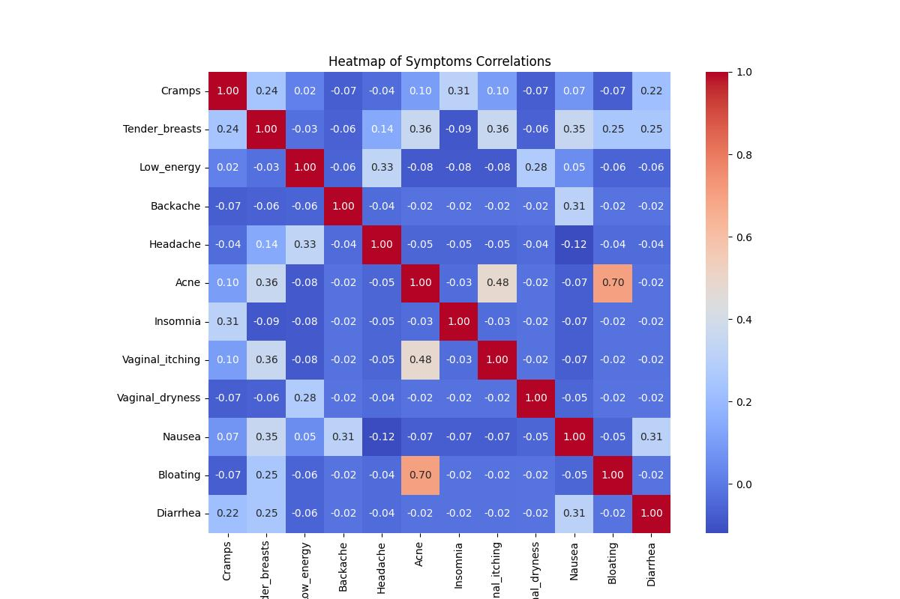
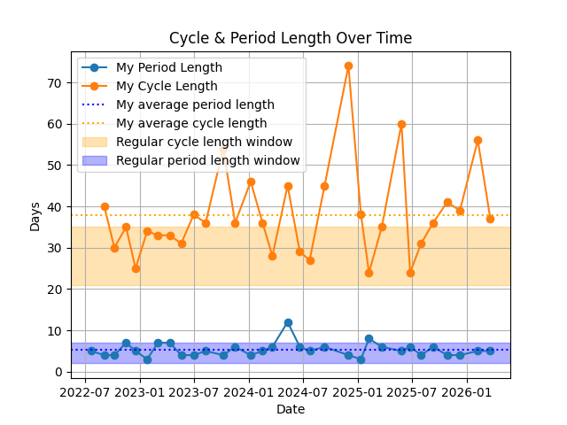
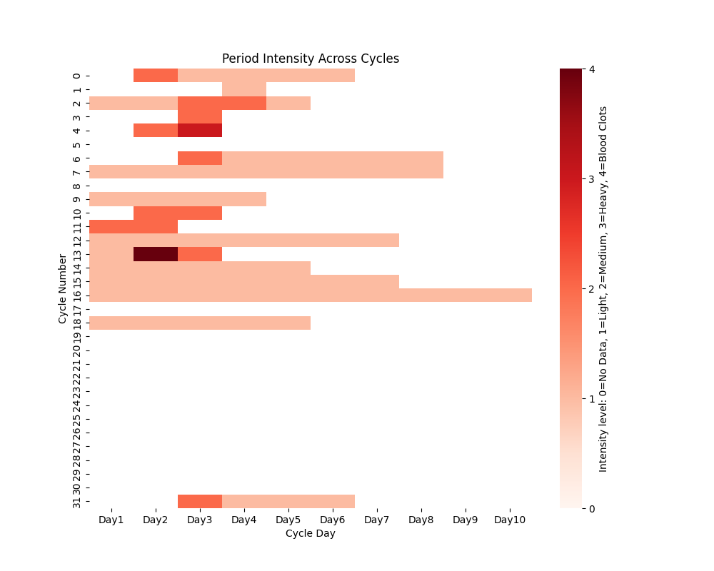

# Menstrual-Symptoms-Analysis-
A raging tech girly trying to find if the birth controls and hormones have been f**king me up and how have they been f--king me up

<u>Tools:</u>

Python, jupyter notebook, git, github heheh. Maybe marimo later as well for ML models

<u>Libraries:</u>

pandas, seaborn, matplotplib, numpy etc. with all that data science shabam

**Ongoing Analysis**:

This plot tells me stuffs like if I'm bloated then I will most likely have breakouts and be ugly for a couple of days. The closer the number is to 1, the higher the correlation between the symptoms. Note that the correlation presented may not fully reflect reality and may alter depends on which pacakage (aka math) is used to calculate it. I will return to the math shortly. 

This plot compares my average period and cycle length with the regular period and cycle length according to [Mayo Clinic](https://www.mayoclinic.org/healthy-lifestyle/womens-health/in-depth/menstrual-cycle/art-20047186). Note that I was on Kyleena for this whole time, and I’ve noticed my menstrual cycle has been prolonged since starting Kyleena. 

Orange see-through area is the window for regular cycle length, my cycle length is the orange line with dots. So you see that my cycle length (orange stuffs in the plot) is off the f**king charts thanks to the stupid side effects of birth control. 

This plot shows the period intensity for each day for all my periods. Distinct values in data are 1-4 where 1 represents light, 2 for medium, 3 for heavy and 4 for blood clots. My period intensity has been pretty light overall, and I've been lazy logging my period intensity for a good while. And also can I say this is the kind of overview I don't get from Fl* while I'm paying 169NOK for my yearly subscription. #whatamipayingfor

